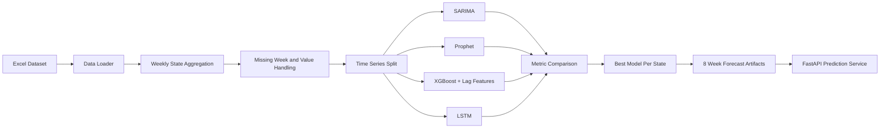

# Architecture



## Service Boundary

Training is an offline batch job:

```bash
python -m app.train
```

Serving is a lightweight API that reads saved artifacts:

```bash
python run_api.py
```

This avoids slow model training during user-facing API requests.

